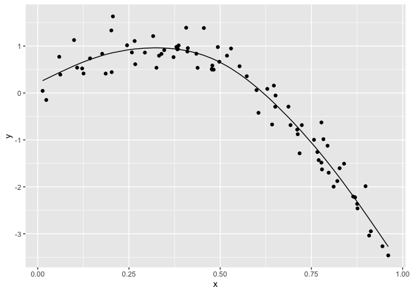

linear_models
================
Paula Wu
11/16/2021

``` r
library(tidyverse)
```

    ## ── Attaching packages ─────────────────────────────────────── tidyverse 1.3.1 ──

    ## ✓ ggplot2 3.3.5     ✓ purrr   0.3.4
    ## ✓ tibble  3.1.5     ✓ dplyr   1.0.7
    ## ✓ tidyr   1.1.4     ✓ stringr 1.4.0
    ## ✓ readr   2.0.1     ✓ forcats 0.5.1

    ## ── Conflicts ────────────────────────────────────────── tidyverse_conflicts() ──
    ## x dplyr::filter() masks stats::filter()
    ## x dplyr::lag()    masks stats::lag()

``` r
library(modelr)
library(mgcv)
```

    ## Loading required package: nlme

    ## 
    ## Attaching package: 'nlme'

    ## The following object is masked from 'package:dplyr':
    ## 
    ##     collapse

    ## This is mgcv 1.8-38. For overview type 'help("mgcv-package")'.

``` r
set.seed(1)
```

# focus on non-linearity

## Simulate a dataset

``` r
nonlin_df = 
  tibble(
    id = 1:100,
    x = runif(100, 0, 1),
    y = 1 - 10 * (x - .3) ^ 2 + rnorm(100, 0, .3)
  )

nonlin_df %>% 
  ggplot(aes(x = x, y = y))+
  geom_point() # not a linear line
```

<!-- -->

Create splits by hand; plot; then fit some models

``` r
train_df = sample_n(nonlin_df, 80)
test_df = anti_join(nonlin_df, train_df, by = "id") # find the people who are not over-lapping in the training dataframe
ggplot(train_df, aes(x = x, y = y))+
  geom_point()+
  geom_point(data = test_df, color = "red")
```

<!-- -->

Fit my models:

``` r
linear_mod = lm(y~x, data = train_df)
smooth_mod  = mgcv::gam(y ~s(x), data = train_df)
wiggly_mod = mgcv::gam(y ~s(x, k = 30), sp = 10e-6, data = train_df)  # force the gam model to become bad
```

plot the results

``` r
train_df %>% 
  add_predictions(smooth_mod) %>% 
  ggplot(aes(x = x, y = y))+
  geom_point() +
  geom_line(aes(y = pred))
```

<!-- -->

quantify the results

``` r
rmse(linear_mod, test_df)  # take the linear model and calculate root mean squared error
```

    ## [1] 0.7052956

``` r
rmse(smooth_mod, test_df)
```

    ## [1] 0.2221774

``` r
rmse(wiggly_mod, test_df)
```

    ## [1] 0.289051
