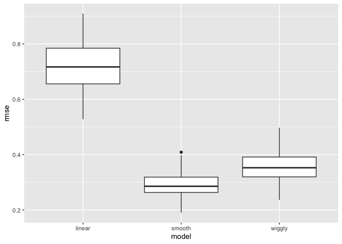
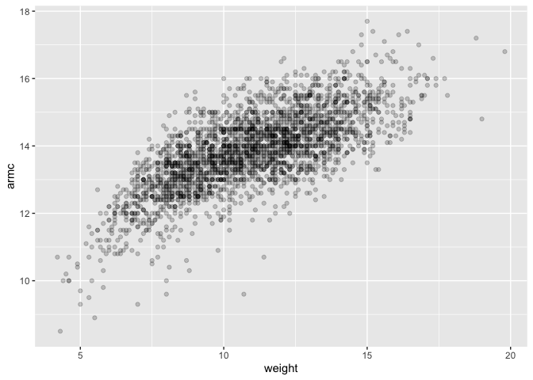
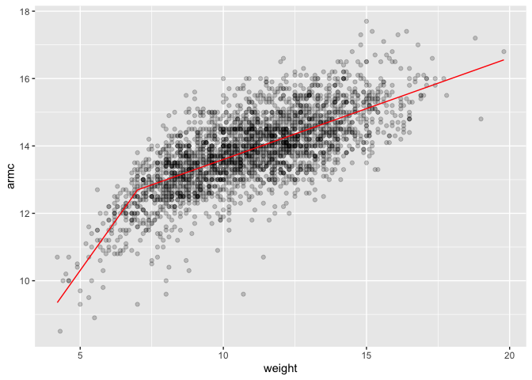
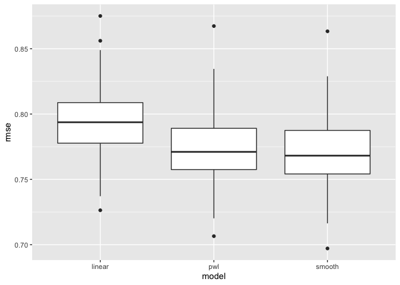

linear_models
================
Paula Wu
11/16/2021

``` r
library(tidyverse)
```

    ## ── Attaching packages ─────────────────────────────────────── tidyverse 1.3.1 ──

    ## ✓ ggplot2 3.3.5     ✓ purrr   0.3.4
    ## ✓ tibble  3.1.5     ✓ dplyr   1.0.7
    ## ✓ tidyr   1.1.4     ✓ stringr 1.4.0
    ## ✓ readr   2.0.1     ✓ forcats 0.5.1

    ## ── Conflicts ────────────────────────────────────────── tidyverse_conflicts() ──
    ## x dplyr::filter() masks stats::filter()
    ## x dplyr::lag()    masks stats::lag()

``` r
library(modelr)
library(mgcv)
```

    ## Loading required package: nlme

    ## 
    ## Attaching package: 'nlme'

    ## The following object is masked from 'package:dplyr':
    ## 
    ##     collapse

    ## This is mgcv 1.8-38. For overview type 'help("mgcv-package")'.

``` r
set.seed(1)
```

# focus on non-linearity

## Simulate a dataset

``` r
nonlin_df = 
  tibble(
    id = 1:100,
    x = runif(100, 0, 1),
    y = 1 - 10 * (x - .3) ^ 2 + rnorm(100, 0, .3)
  )

nonlin_df %>% 
  ggplot(aes(x = x, y = y))+
  geom_point() # not a linear line
```

<!-- -->

Create splits by hand; plot; then fit some models

``` r
train_df = sample_n(nonlin_df, 80)
test_df = anti_join(nonlin_df, train_df, by = "id") # find the people who are not over-lapping in the training dataframe
ggplot(train_df, aes(x = x, y = y))+
  geom_point()+
  geom_point(data = test_df, color = "red")
```

<!-- -->

Fit my models:

``` r
linear_mod = lm(y~x, data = train_df)
smooth_mod  = mgcv::gam(y ~s(x), data = train_df)
wiggly_mod = mgcv::gam(y ~s(x, k = 30), sp = 10e-6, data = train_df)  # force the gam model to become bad
```

plot the results

``` r
train_df %>% 
  add_predictions(smooth_mod) %>% 
  ggplot(aes(x = x, y = y))+
  geom_point() +
  geom_line(aes(y = pred))
```

<!-- -->

quantify the results

``` r
rmse(linear_mod, test_df)  # take the linear model and calculate root mean squared error
```

    ## [1] 0.7052956

``` r
rmse(smooth_mod, test_df)
```

    ## [1] 0.2221774

``` r
rmse(wiggly_mod, test_df)
```

    ## [1] 0.289051

## CV iteratively

Use `modelr::crossv_mc`

``` r
cv_df = 
  crossv_mc(nonlin_df, 100) %>%   # monte-carlos
  mutate(
    train = map(train, as_tibble),  # transform to tibble
    test = map(test, as_tibble)
  )
#cv_df %>% 
#  pull(train) %>% .[[1]]  # give me the first list element
```

Let’s fit some models…

``` r
cv_df = 
  cv_df %>% 
  mutate(
    linear_mod = map(.x = train, ~lm(y ~ x, data = .x)),
    smooth_mod = map(.x = train, ~gam(y ~ s(x), data = .x)),
    wiggly_mod = map(.x = train, ~gam(y ~ s(x, k = 30), sp = 10e-6, data = .x))
  ) %>% 
  mutate(
    rmse_linear = map2_dbl(.x = linear_mod, .y = test, ~rmse(model = .x, data = .y)),  #the _dbl will show the numbers
    rmse_smooth = map2_dbl(.x = smooth_mod, .y = test, ~rmse(model = .x, data = .y)),
    rmse_wiggly = map2_dbl(.x = wiggly_mod, .y = test, ~rmse(model = .x, data = .y))
  )
```

Look at output

``` r
cv_df %>% 
  select(starts_with("rmse")) %>% 
  pivot_longer(
    everything(),
    names_to = "model",
    values_to = "rmse",
    names_prefix = "rmse_"
  ) %>% 
  ggplot(aes(x = model, y = rmse))+
  geom_boxplot()
```

<!-- -->

## Child growth data

import data

``` r
child_growth_df = 
  read_csv("./data/nepalese_children.csv") %>% 
  mutate(# add for pwl_model to work
    weight_cp = (weight >7) * (weight - 7)
  )
```

    ## Rows: 2705 Columns: 5

    ## ── Column specification ────────────────────────────────────────────────────────
    ## Delimiter: ","
    ## dbl (5): age, sex, weight, height, armc

    ## 
    ## ℹ Use `spec()` to retrieve the full column specification for this data.
    ## ℹ Specify the column types or set `show_col_types = FALSE` to quiet this message.

``` r
child_growth_df %>% 
  ggplot(aes(x = weight, y = armc))+
  geom_point(alpha = .2)
```

<!-- -->

Consider candidate models

``` r
linear_mod = lm(armc ~ weight, data = child_growth_df)
pwl_mod = lm(armc ~ weight + weight_cp, data = child_growth_df)
smooth_mod = gam(armc ~ s(weight), data = child_growth_df)
```

``` r
child_growth_df %>% 
  add_predictions(pwl_mod) %>% # pick up the downward trajectory below 7, and is a linear model, not smoothed
  ggplot(aes(x = weight, y = armc))+
  geom_point(alpha = 0.2)+
  geom_line(aes(y = pred), color = "red")
```

<!-- -->
Use CV to compare models

``` r
cv_df = 
  crossv_mc(child_growth_df, 100) %>%   # monte-carlos
  mutate(
    train = map(train, as_tibble),  # transform to tibble
    test = map(test, as_tibble)
  )
```

Fit models and extract RMSE

``` r
cv_df = 
  cv_df %>% 
  mutate(
    linear_mod = map(.x = train, ~lm(armc ~ weight, data = .x)),
    smooth_mod = map(.x = train, ~gam(armc ~ s(weight), data = .x)),
    pwl_mod = map(.x = train, ~lm(armc ~ weight + weight_cp, data = .x))
  ) %>% 
  mutate(
    rmse_linear = map2_dbl(.x = linear_mod, .y = test, ~rmse(model = .x, data = .y)),  #the _dbl will show the numbers
    rmse_pwl = map2_dbl(.x = pwl_mod, .y = test, ~rmse(model = .x, data = .y)),
    rmse_smooth = map2_dbl(.x = smooth_mod, .y = test, ~rmse(model = .x, data = .y))
  )
```

Look at RMSE distribution

``` r
cv_df %>% 
  select(starts_with("rmse")) %>% 
  pivot_longer(
    everything(),
    names_to = "model",
    values_to = "rmse",
    names_prefix = "rmse_"
  ) %>% 
  ggplot(aes(x = model, y = rmse))+
  geom_boxplot()
```

<!-- -->
